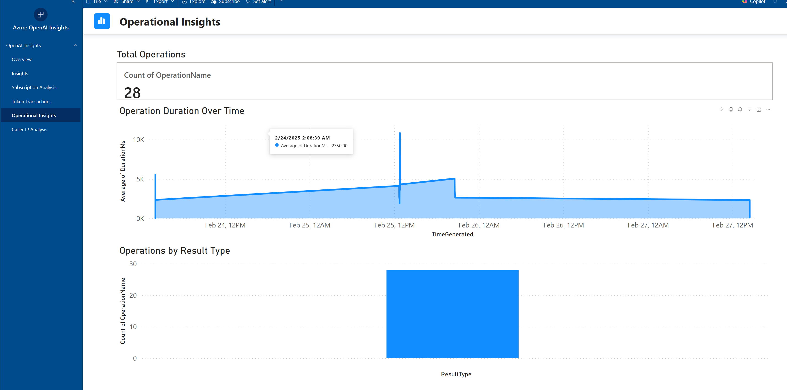

# Azure OpenAI Insights

This project undertakes the development of a common report that can be used for display information about your Azure OpenAI Estate across your tenant.  
This is an ongoing project and contributions are welcomed.

**Prerquisites**

> Before you can use this code you will need to set up a log analytics workspace where you are going to dump your diagnostic settings  
To set up `diagnostic settings` go to your `Log Analytics` workspace and open `Monitor` and then choose `Diagnostic Settings`. From there you will need to click on the `+ Add Diagnostic Settings`

  
You must determine what you want to send to Log Analytics, in the case above I sent everything but you may decide to forego sending the tracing information.  

**Pick your settings** 

---  

> You will need to change the parameter for Log Analytics workspace Id to the workspace Id where you dumped your data. You will need to go to `Transform Data` and update the parameter `LogAnalyticsWorskspaceId`.

## Sources  
The data is pulled from `Azure Resource Graph` and `Azure Log Analytics` 

### Screen captures of the report  

**Overview**

**Insights**

**Operations**

**Subscriptions**

**Calls by IP**

**Token Transactions**

